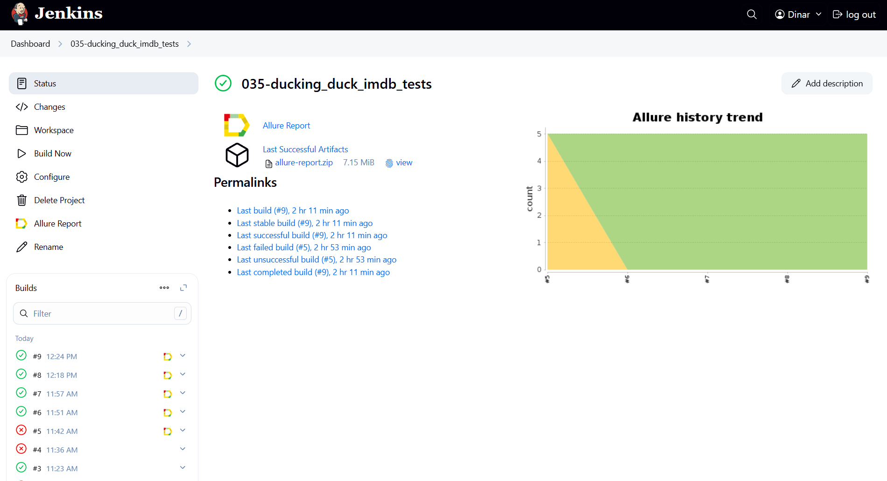
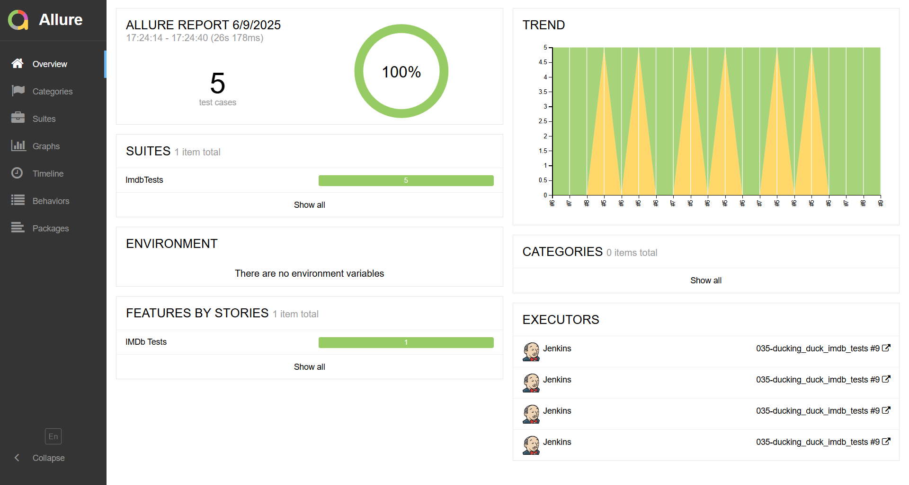
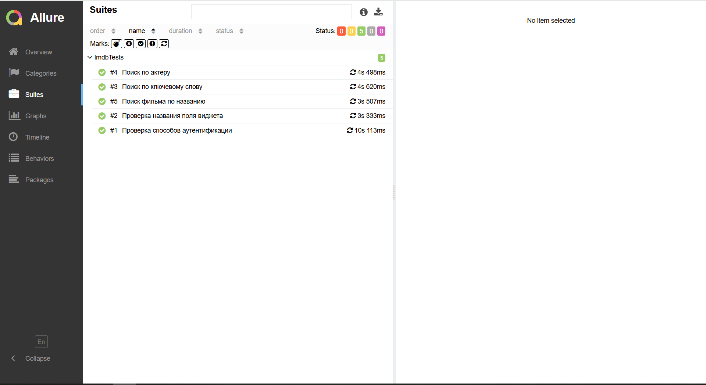
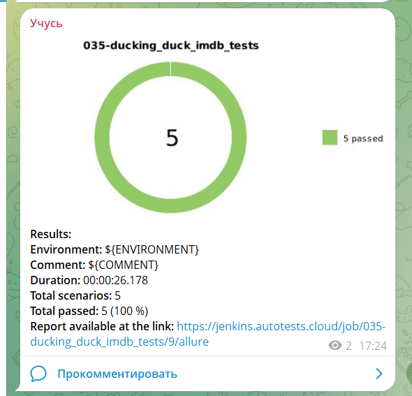

# Проект по автоматизации тестирования для сервиса [IMDb](https://s.media-imdb.com/)

> IMDB — веб-сайт с крупнейшей в мире базой данных о кинематографе..

## **Содержание:**
____

* <a href="#tools">Технологии и инструменты</a>

* <a href="#cases">Примеры автоматизированных тест-кейсов</a>

* <a href="#jenkins">Сборка в Jenkins</a>

* <a href="#allure">Allure отчет</a>

* <a href="#telegram">Уведомление в Telegram при помощи бота</a>

* <a href="#video">Примеры видео выполнения тестов на Selenoid</a>
____

## <a name="Технологии и инструменты">**Технологии и инструменты:**</a>

  
  
  
  
  
  
  
  
  
  

____

## <a name="Примеры автоматизированных тест-кейсов">**Примеры автоматизированных тест-кейсов:**</a>
____
- ✓ *Поиск фильма по названию*
- ✓ *Проверка названия поля виджета*
- ✓ *Проверка способов аутентификации*
- ✓ *Поиск по ключевому слову
- ✓ *Поиск по актеру*

____

## </a>Сборка в [Jenkins](https://jenkins.autotests.cloud/job/035-ducking_duck_imdb_tests/)</a>
____

  
  

### **Параметры сборки в Jenkins:**

- *browser (браузер, по умолчанию chrome)*
- *browserSize (размер окна браузера, по умолчанию 1920x1080)*
- *baseUrl (адрес тестируемого веб-сайта)*
- *remoteUrl (логин, пароль и адрес удаленного сервера Selenoid)*

___

## </a> Allure [отчет](https://jenkins.autotests.cloud/job/035-ducking_duck_imdb_tests/allure/)</a>
___

### *Основная страница отчёта*

  
  

  

### *Тест-кейсы*

  
  

___ 

____

## </a> Уведомление в Telegram при помощи бота
____

  
  
